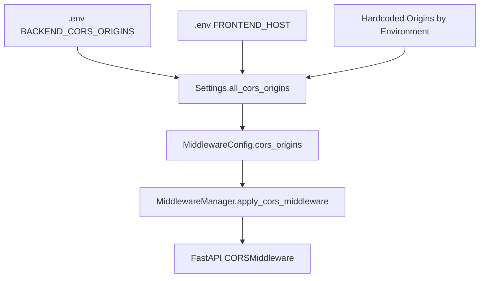

# CORS Configuration Guide

## Overview

CORS (Cross-Origin Resource Sharing) origins are now managed centrally in a **single source of truth** to avoid maintenance issues and configuration drift.

## Single Source of Truth

**Location**: `backend/app/core/config.py` → `Settings.all_cors_origins` property

This computed property consolidates all CORS origins from multiple sources:

### 1. Environment Variables (`.env`)
```bash
BACKEND_CORS_ORIGINS="http://localhost,http://localhost:5173,https://localhost,https://localhost:5173,http://127.0.0.1,http://127.0.0.1:5173,http://hero365.ai,https://hero365.ai"
FRONTEND_HOST=http://localhost:5173
```

### 2. Development Origins (Auto-included for `ENVIRONMENT=local`)
- `http://localhost:3000`
- `http://localhost:3001` 
- `http://127.0.0.1:3000`
- `http://127.0.0.1:3001`
- `https://localhost:3000`
- `https://localhost:5173`

### 3. Cloudflare Pages Domains (Auto-included for all environments)
- `https://hero365-contractors-webs.pages.dev` (main project)
- Specific deployment URLs (add as needed)

### 4. Production Domains (Auto-included for `ENVIRONMENT=production`)
- `https://api.hero365.ai`
- `https://hero365.ai`
- `https://www.hero365.ai`
- `https://app.hero365.ai`

## Adding New Deployment URLs

### For New Cloudflare Pages Deployments:

1. **Temporary** (requires backend restart):
   Edit `backend/app/core/config.py` and add the new URL to the Cloudflare Pages section:
   ```python
   # 4. Cloudflare Pages domains (for website deployments)
   cors_origins.extend([
       "https://hero365-contractors-webs.pages.dev",
       "https://bb076026.hero365-contractors-webs.pages.dev",
       "https://NEW_DEPLOYMENT_ID.hero365-contractors-webs.pages.dev",  # Add here
   ])
   ```

2. **Permanent** (for custom domains):
   Add to the `.env` file:
   ```bash
   BACKEND_CORS_ORIGINS="...,https://contractor-custom-domain.com"
   ```

## Configuration Flow



## Benefits of Centralized Configuration

✅ **Single Source of Truth**: All CORS logic in one place  
✅ **Environment-Aware**: Automatic origins based on environment  
✅ **No Duplication**: Eliminates multiple CORS definitions  
✅ **Easy Maintenance**: Add new origins in one location  
✅ **Automatic Deduplication**: Removes duplicate origins  
✅ **Clear Documentation**: Each origin type is clearly categorized  

## Migration Notes

**Removed Files**:
- `backend/app/api/middleware/cors_handler.py` (unused duplicate logic)

**Simplified Configuration**:
- Environment variables now only contain base origins
- Cloudflare Pages domains managed in code for better version control
- Development origins automatically included based on environment

## Testing CORS

```bash
# Test CORS preflight for Cloudflare Pages
curl -X OPTIONS "https://your-ngrok-url.ngrok-free.app/api/v1/public/contractors/featured-projects/business-id" \
  -H "Origin: https://deployment-id.hero365-contractors-webs.pages.dev" \
  -H "Access-Control-Request-Method: GET" \
  -v

# Should return HTTP 200 with:
# access-control-allow-origin: https://deployment-id.hero365-contractors-webs.pages.dev
```
