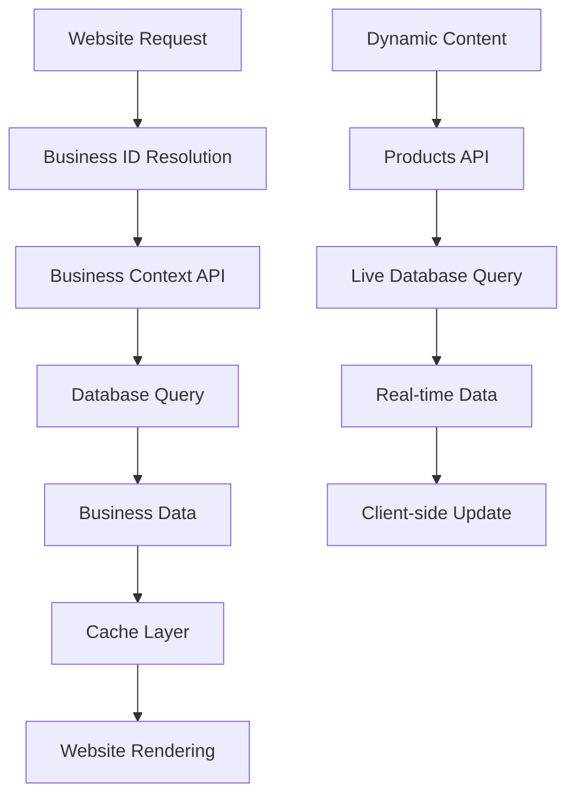

# Dynamic Business Data Architecture

## Problem Statement

The current system has hardcoded business references and static data that should be dynamically fetched from the database/API. We need to eliminate all hardcoded business names, addresses, phone numbers, and other business-specific data.

## Current Issues Found

### 1. Hardcoded Static Files
- `website-builder/lib/shared/data/business.json` - Contains hardcoded business data
- `website-builder/config/business-config.json` - Generated with hardcoded values
- `website-builder/lib/shared/data/locations.json` - Static location data

### 2. Fallback Data with Hardcoded Values
- `website-builder/lib/server/business-context-loader.ts` - Contains fallback business context with hardcoded data
- `website-builder/lib/server/build-time/activity-seo-generator.ts` - Mock business data function

### 3. Environment Variable Dependencies
- System relies on `NEXT_PUBLIC_BUSINESS_*` environment variables
- These should be fetched from database instead

## Proposed Architecture

### 1. Database-First Approach

All business data should come from the `businesses` table and related tables:

```sql
-- Core business data
SELECT * FROM businesses WHERE id = $business_id;

-- Service areas
SELECT * FROM service_areas WHERE business_id = $business_id;

-- Business services
SELECT * FROM business_services WHERE business_id = $business_id;

-- Technicians
SELECT * FROM technicians WHERE business_id = $business_id;

-- Featured projects
SELECT * FROM featured_projects WHERE business_id = $business_id;

-- Testimonials
SELECT * FROM testimonials WHERE business_id = $business_id;

-- Products (dynamic, API-fetched)
SELECT * FROM products WHERE business_id = $business_id;
```

### 2. Data Loading Strategy

#### Build-Time Data (Static)
- Business profile information
- Service areas
- Business services configuration
- Trade profiles and activities
- Testimonials and awards
- Featured projects

#### Runtime Data (Dynamic API)
- Products and inventory
- Current pricing
- Real-time availability
- Live chat status
- Current promotions

### 3. API Endpoints Structure

#### Core Business Context API
```
GET /api/public/contractors/context/{business_id}
```
Returns complete business context including:
- Business profile
- Selected activities
- Service areas
- Trade configuration
- Technicians
- Static content

#### Dynamic Products API
```
GET /api/public/contractors/products/{business_id}
```
Returns current products with:
- Live inventory
- Current pricing
- Availability status

#### Dynamic Services API
```
GET /api/public/contractors/services/{business_id}
```
Returns current service offerings with:
- Real-time pricing
- Availability
- Booking status

### 4. Implementation Plan

#### Phase 1: Remove Hardcoded Data
1. Delete static business data files
2. Remove hardcoded fallbacks
3. Update business context loader to be purely API-driven

#### Phase 2: Dynamic Business Resolution
1. Implement business ID resolution from domain/subdomain
2. Create business context caching layer
3. Update all components to use dynamic data

#### Phase 3: Runtime Data Integration
1. Implement client-side data fetching for dynamic content
2. Add loading states and error handling
3. Implement real-time updates where needed

## Business ID Resolution Strategy

### Option 1: Domain-Based Resolution
```typescript
// Extract business from domain
const businessId = await getBusinessIdFromDomain(request.headers.host);
```

### Option 2: Subdomain-Based Resolution
```typescript
// Extract from subdomain: {business}.hero365.com
const businessId = extractBusinessFromSubdomain(request.headers.host);
```

### Option 3: Path-Based Resolution
```typescript
// Extract from path: /business/{business_id}/...
const businessId = extractBusinessFromPath(request.url);
```

## Data Flow Architecture



## Caching Strategy

### Build-Time Cache
- Business profile data
- Service configurations
- Static content blocks
- SEO metadata

### Runtime Cache
- Redis cache for business context (5-minute TTL)
- CDN cache for static assets
- Browser cache for unchanging data

### Cache Invalidation
- Business profile changes → Clear business context cache
- Service updates → Clear service cache
- Product changes → No cache (always fresh)

## Environment Variables (Simplified)

Remove all business-specific environment variables:
```bash
# Remove these:
# NEXT_PUBLIC_BUSINESS_NAME
# NEXT_PUBLIC_BUSINESS_PHONE  
# NEXT_PUBLIC_BUSINESS_EMAIL
# NEXT_PUBLIC_BUSINESS_CITY
# etc.

# Keep only:
NEXT_PUBLIC_API_URL=https://api.hero365.com
NEXT_PUBLIC_ENVIRONMENT=production
```

## Implementation Files to Update

### 1. Business Context Loader
```typescript
// website-builder/lib/server/business-context-loader.ts
export async function getBusinessContext(businessId: string): Promise<BusinessContext> {
  // Always fetch from API, no fallbacks with hardcoded data
  const response = await fetch(`${API_URL}/api/public/contractors/context/${businessId}`);
  if (!response.ok) {
    throw new Error(`Business not found: ${businessId}`);
  }
  return response.json();
}
```

### 2. Dynamic Business Resolution
```typescript
// website-builder/lib/server/business-resolver.ts
export async function resolveBusinessId(request: Request): Promise<string> {
  const host = request.headers.get('host');
  
  // Try domain mapping first
  const businessId = await getBusinessIdFromDomain(host);
  if (businessId) return businessId;
  
  // Fallback to subdomain
  return extractBusinessFromSubdomain(host);
}
```

### 3. Product Data Fetching
```typescript
// website-builder/lib/api/products.ts
export async function getBusinessProducts(businessId: string) {
  // Always fetch fresh from API
  const response = await fetch(`${API_URL}/api/public/contractors/products/${businessId}`);
  return response.json();
}
```

## Migration Steps

1. **Audit Current Hardcoded References**
   - Search for all hardcoded business names
   - Identify static data files
   - List environment variable dependencies

2. **Create Business Resolution System**
   - Implement domain → business_id mapping
   - Add business context API integration
   - Create caching layer

3. **Update All Components**
   - Remove static data dependencies
   - Add business context props
   - Implement error handling

4. **Test with Multiple Businesses**
   - Verify data isolation
   - Test domain switching
   - Validate cache behavior

5. **Deploy and Monitor**
   - Monitor API performance
   - Track cache hit rates
   - Verify business data accuracy

## Success Criteria

- ✅ No hardcoded business references in code
- ✅ All business data fetched from database
- ✅ Multiple businesses can be deployed on same codebase
- ✅ Dynamic content updates without redeploy
- ✅ Fast page load times with proper caching
- ✅ Graceful error handling for missing data
