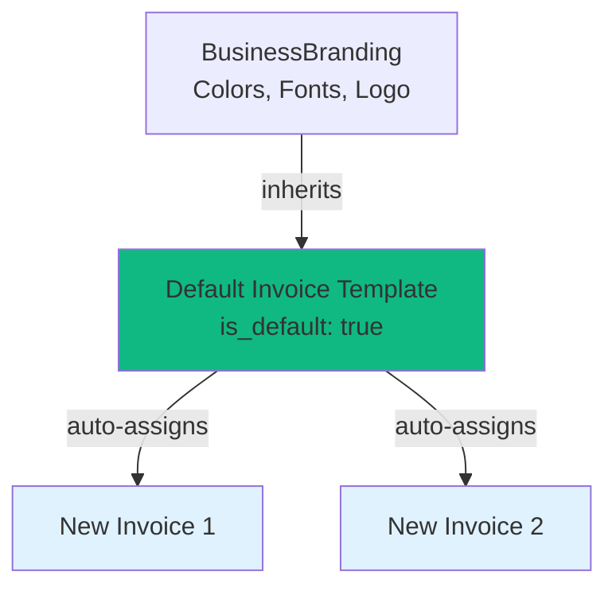

# Set Default Template API

## Overview

Users can now set any active template as the default template for their business document type (invoices, estimates, contracts, etc.) through the template update API.

## Endpoint

**PUT** `/api/v1/templates/{template_id}`

## How Default Templates Work

### Business Rules
- ✅ **One default per document type**: Each business can have one default template per document type (one for invoices, one for estimates, etc.)
- ✅ **Auto-unsetting**: Setting a new default automatically removes the default flag from the previous template
- ✅ **Active templates only**: Only active templates can be set as default
- ✅ **Business ownership**: Templates can only be set as default by the business that owns them

### Database Constraint
```sql
CONSTRAINT document_templates_unique_default_per_type 
UNIQUE (business_id, document_type, is_default)
```

This ensures only one default template per business per document type.

## API Usage

### Request Schema
```json
{
  "name": "Professional Invoice Template",
  "description": "Updated description", 
  "is_active": true,
  "is_default": true,  // ← New field to set as default
  "branding_id": "branding-uuid"
}
```

### Setting Template as Default
```bash
PUT /api/v1/templates/13FEEB04-7B58-469F-8648-16AD19A24178
Content-Type: application/json

{
  "is_default": true
}
```

### Response
```json
{
  "id": "13FEEB04-7B58-469F-8648-16AD19A24178",
  "name": "Professional Invoice Template",
  "document_type": "invoice",
  "is_default": true,  // ← Now marked as default
  "is_active": true,
  "business_id": "660e8400-e29b-41d4-a716-446655440000",
  "usage_count": 15,
  "created_date": "2025-01-15T10:00:00Z",
  "last_modified": "2025-01-18T14:30:00Z"
}
```

## Impact on Invoice/Estimate Creation

### Automatic Template Assignment
When creating invoices/estimates without specifying a `template_id`:

```json
// Creating invoice without template_id
POST /api/v1/invoices
{
  "title": "New Invoice",
  "contact_id": "contact-uuid",
  // template_id not specified
}

// System automatically assigns default template
// Final invoice will have: template_id = "13FEEB04-7B58-469F-8648-16AD19A24178"
```

### Business Branding Inheritance
Default templates work with the centralized branding system:



## Use Cases

### 1. Set New Default Template
```bash
# Business wants to switch from basic to professional template
PUT /api/v1/templates/professional-template-id
{
  "is_default": true
}
```

### 2. Update Template AND Set as Default
```bash
# Update template properties and make it default
PUT /api/v1/templates/template-id
{
  "name": "Updated Professional Template",
  "description": "Now includes new branding elements",
  "is_default": true
}
```

### 3. Create Template as Default
```bash
# Create new template and immediately set as default
POST /api/v1/templates
{
  "name": "New Default Template",
  "document_type": "invoice",
  "branding_id": "business-branding-id"
}

# Then set as default
PUT /api/v1/templates/{new-template-id}
{
  "is_default": true
}
```

## Error Handling

### Template Not Found
```json
// 404 Not Found
{
  "detail": "Template not found"
}
```

### Permission Denied
```json
// 404 Not Found (security - don't reveal existence)
{
  "detail": "Template not found"
}
```

### Inactive Template
```json
// 400 Bad Request
{
  "detail": "Cannot set inactive template as default"
}
```

### Wrong Document Type
```json
// 400 Bad Request  
{
  "detail": "Template document type does not match"
}
```

## Get Current Default Template

### Endpoint
**GET** `/api/v1/templates/invoices?is_active=true`

### Response
```json
[
  {
    "id": "template-1-id",
    "name": "Basic Invoice",
    "is_default": false,
    "document_type": "invoice"
  },
  {
    "id": "template-2-id", 
    "name": "Professional Invoice",
    "is_default": true,  // ← This is the default
    "document_type": "invoice"
  }
]
```

## Mobile App Integration

### Template Selection UI
```swift
// Show default template prominently
if template.isDefault {
    templateView.badge = "Default"
    templateView.isRecommended = true
}
```

### Setting Default Flow
```swift
// User selects "Set as Default"
templateAPI.updateTemplate(templateId) {
    isDefault: true
}
.onSuccess { 
    showToast("Template set as default")
    refreshTemplateList()
}
```

## Benefits

✅ **Streamlined workflow**: New invoices automatically use consistent branding  
✅ **Centralized control**: Change default once, affects all new documents  
✅ **Brand consistency**: Ensures all customer-facing documents look professional  
✅ **Easy switching**: Can change defaults as business needs evolve  

## Technical Implementation

### Backend Flow
1. **Validation**: Check template ownership, active status, document type
2. **Unset current default**: Remove default flag from existing default template
3. **Set new default**: Update target template with default flag
4. **Return updated**: Send back the updated template with default status

### Database Updates
```sql
-- Step 1: Unset existing default
UPDATE document_templates 
SET is_default = FALSE 
WHERE business_id = ? AND document_type = ? AND is_default = TRUE;

-- Step 2: Set new default  
UPDATE document_templates 
SET is_default = TRUE, last_modified = NOW()
WHERE id = ? AND business_id = ? AND document_type = ?;
```

This ensures atomic updates and maintains the one-default-per-type constraint.
