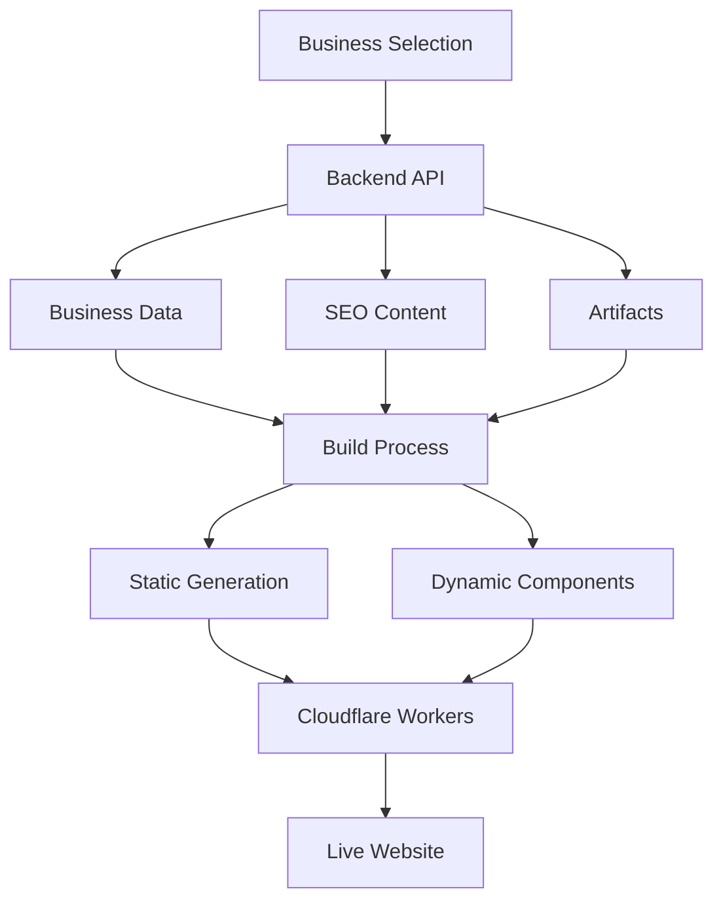

# 🔄 Website Configuration & Build Flow

## Executive Summary

This document explains how website configurations flow from the backend to the website builder during the build and deployment process. The system uses a multi-stage approach that fetches business data, generates SEO content, and builds a customized website for each contractor.

## 📊 Architecture Overview



## 🚀 Deployment Process

### 1. **Business Selection & Initiation**

The deployment starts with the interactive deployer script:

```bash
# Interactive selection from database
./scripts/deploy-business-website.sh

# Or direct deployment with business ID
node website-builder/scripts/deploy-with-business.js \
  --businessId=<uuid> \
  --env=production
```

### 2. **Data Fetching Pipeline**

The deployment script fetches configuration from multiple backend endpoints:

#### **Business Profile Data**
```javascript
// Fetches from: /api/v1/public/contractors/profile/{businessId}
const businessData = await fetchBusinessData(businessId, apiUrl);

// Returns:
{
  business_name: "Hero HVAC Services",
  email: "contact@herohvac.com",
  phone: "(512) 555-0100",
  address: "123 Main St",
  city: "Austin",
  state: "TX",
  primary_trade: "hvac",
  selected_activity_slugs: ["ac-repair", "hvac-installation"],
  service_areas: ["Austin", "Round Rock", "Cedar Park"]
}
```

#### **SEO Content Generation**
```javascript
// Triggers: POST /api/v1/seo/deploy/{businessId}
const seoDeployment = await triggerSEODeployment(businessId);

// Then fetches: GET /api/v1/seo/pages/{businessId}
const seoPages = await fetchSEOPages(businessId);

// Returns:
{
  pages: {
    "/services/ac-repair/austin": {
      title: "AC Repair in Austin, TX",
      meta_description: "Professional AC repair...",
      h1_heading: "Expert AC Repair in Austin",
      content: "...",
      schema_markup: {...}
    }
  },
  content_blocks: {
    "/services/ac-repair/austin": {
      hero: {...},
      benefits: {...},
      faqs: [...]
    }
  }
}
```

#### **Artifact Fetching**
```javascript
// Fetches: GET /api/v1/artifacts/{businessId}
const artifacts = await fetchArtifacts(businessId);

// Returns activity-specific content with LLM enhancements
{
  artifacts: [
    {
      artifact_id: "uuid",
      activity_slug: "hvac-repair",
      title: "HVAC Repair Services",
      hero: { /* LLM-generated content */ },
      benefits: { /* Trade-specific benefits */ },
      activity_modules: [
        { module_type: "hvac_efficiency_calculator", config: {...} }
      ]
    }
  ]
}
```

#### **Website Context Aggregation**
```javascript
// Fetches: GET /api/v1/public/contractors/website/context/{businessId}
const websiteContext = await fetchWebsiteContext(businessId);

// Returns comprehensive business context:
{
  business: { /* Core business info */ },
  activities: [ /* Selected trade activities */ ],
  service_templates: [ /* Service configurations */ ],
  trades: [ /* Trade profiles */ ],
  technicians: [ /* Team profiles */ ],
  projects: [ /* Completed projects */ ],
  testimonials: [ /* Customer reviews */ ]
}
```

### 3. **Build-Time Configuration**

The fetched data is processed during build time:

#### **Environment Variables Generation**
```javascript
// Generated .env.local for build
NEXT_PUBLIC_BUSINESS_ID=<uuid>
NEXT_PUBLIC_BUSINESS_NAME="Hero HVAC Services"
NEXT_PUBLIC_BUSINESS_EMAIL="contact@herohvac.com"
NEXT_PUBLIC_BUSINESS_PHONE="(512) 555-0100"
NEXT_PUBLIC_BUSINESS_CITY="Austin"
NEXT_PUBLIC_BUSINESS_STATE="TX"
NEXT_PUBLIC_API_URL="https://api.hero365.com"
```

#### **Static File Generation**
```javascript
// Generated at build time
/lib/generated/
  ├── seo-pages.js        // All SEO page content
  ├── business-config.js   // Business configuration
  ├── navigation.js        // Dynamic navigation
  └── artifacts.js         // Activity artifacts
```

### 4. **Build Process**

```bash
# Next.js build with configuration
npm run build

# What happens during build:
1. Load environment variables
2. Import generated static files
3. Pre-render static pages (SSG)
4. Generate dynamic routes
5. Optimize assets
6. Create deployment bundle
```

### 5. **Component Data Flow**

#### **Static Pages (Build Time)**
```typescript
// app/(marketing)/page.tsx
async function loadBusinessData(businessId: string) {
  // Server-side data fetching during build
  const [profile, services, products] = await Promise.all([
    fetch(`${backendUrl}/api/v1/public/contractors/profile/${businessId}`),
    fetch(`${backendUrl}/api/v1/public/contractors/services/${businessId}`),
    fetch(`${backendUrl}/api/v1/public/contractors/products/${businessId}`)
  ]);
  
  // Data is baked into the static HTML
  return { profile, services, products };
}
```

#### **Dynamic Components (Runtime)**
```typescript
// Client-side hook for dynamic data
export function useWebsiteContext(businessId: string) {
  // Fetches fresh data on client
  const response = await fetch(
    `/api/v1/public/contractors/website/context/${businessId}`
  );
  
  // Used for interactive components
  return {
    business,
    activities,
    technicians,
    projects
  };
}
```

## 🎨 LLM Content Integration

### Content Generation with Business Context

The system leverages full business context for LLM content generation:

```typescript
// Backend LLM prompt includes:
const context = {
  // Business Identity
  business: {
    name, years_in_business, certifications, awards
  },
  
  // Team Profiles
  technicians: [
    { name, experience, certifications, specializations }
  ],
  
  // Project Portfolio
  projects: [
    { title, description, outcome, value, technician }
  ],
  
  // Service Areas
  service_areas: [
    { city, state, coverage_radius, response_time }
  ],
  
  // Customer Success
  testimonials: [
    { text, customer_name, service, rating }
  ]
};

// LLM generates personalized content
const content = await generateWithContext(context);
```

### Component-Specific Generation

Each component receives tailored content:

```typescript
// Hero Section
<HeroSection 
  headline={`${city}'s Most Trusted ${trade} Experts`}
  teamSize={technicians.length}
  experience={combinedExperience}
  rating={averageRating}
/>

// Service Page
<ServicePage
  technicians={qualifiedTechnicians}
  projects={relatedProjects}
  testimonials={serviceTestimonials}
  localFactors={marketInsights}
/>

// About Page
<AboutPage
  teamProfiles={technicians}
  companyStory={businessHistory}
  milestones={achievements}
  community={localInvolvement}
/>
```

## 🔧 Configuration Methods

### Method 1: Full Build & Deploy (Production)

```bash
# Complete pipeline
node deploy-with-business.js \
  --businessId=<uuid> \
  --env=production

# Steps:
1. Fetch all business data from backend
2. Generate SEO content (900+ pages)
3. Build Next.js application
4. Deploy to Cloudflare Workers
5. Configure custom domain
```

### Method 2: Build Only (Development)

```bash
# Build without deployment
node deploy-with-business.js \
  --businessId=<uuid> \
  --build-only

# Used for:
- Local testing
- Preview builds
- CI/CD pipelines
```

### Method 3: Incremental Updates

```bash
# Update specific content
POST /api/v1/seo/regenerate/{businessId}

# Triggers:
1. Regenerate changed pages only
2. Update artifacts
3. Invalidate CDN cache
4. Hot reload on Workers
```

## 📦 Data Flow Architecture

### Build-Time Data (Static)
- Business profile
- Service listings
- Static pages content
- SEO metadata
- Navigation structure

### Runtime Data (Dynamic)
- Booking availability
- Real-time pricing
- Technician schedules
- Live testimonials
- Inventory status

### Hybrid Rendering Strategy
```typescript
// Static with revalidation
export const revalidate = 3600; // 1 hour

// Dynamic when needed
export const dynamic = 'force-dynamic';

// Edge caching
export const runtime = 'edge';
```

## 🚦 Deployment Environments

### Development
```javascript
{
  apiUrl: "http://localhost:8000",
  buildMode: "development",
  caching: false,
  hotReload: true
}
```

### Staging
```javascript
{
  apiUrl: "https://api-staging.hero365.com",
  buildMode: "production",
  caching: true,
  cdnEnabled: true
}
```

### Production
```javascript
{
  apiUrl: "https://api.hero365.com",
  buildMode: "production",
  caching: true,
  cdnEnabled: true,
  customDomain: true
}
```

## 🎯 Key Benefits

### 1. **Personalized Content**
- Every website uses real business data
- LLM generates unique content based on actual team, projects, and services
- No generic templates or placeholder content

### 2. **SEO Optimization**
- 900+ pages generated per business
- Location-specific content for all service areas
- Activity-specific pages with trade expertise

### 3. **Performance**
- Static generation for fast loading
- Edge deployment on Cloudflare Workers
- CDN caching for global performance

### 4. **Scalability**
- Automated deployment pipeline
- Parallel content generation
- Efficient resource usage

## 🔄 Update Workflow

### Content Updates
1. Business updates profile in app
2. Triggers webhook to backend
3. Backend regenerates affected content
4. Pushes update to Workers
5. CDN cache invalidated
6. New content live in < 60 seconds

### Configuration Changes
1. Update business settings
2. Rebuild affected components
3. Deploy incremental changes
4. Zero-downtime updates

## 📊 Monitoring & Analytics

### Build Metrics
- Generation time per business
- Pages generated count
- LLM tokens used
- Build success rate

### Runtime Metrics
- Page load performance
- Conversion rates
- User engagement
- SEO rankings

## 🚀 Future Enhancements

### Planned Improvements
1. **Real-time Preview**: Live preview during configuration
2. **A/B Testing**: Multiple content variants
3. **AI Optimization**: Continuous content improvement
4. **Multi-language**: Automatic translation
5. **Voice Integration**: AI phone answering integration

### Architecture Evolution
- Move to incremental static regeneration (ISR)
- Implement edge-side personalization
- Add real-time collaboration features
- Enhance LLM context with behavioral data

## 📝 Conclusion

The website configuration flow seamlessly integrates backend data with frontend generation, creating highly personalized, SEO-optimized websites for each contractor. The system leverages:

- **Full business context** for authentic content
- **LLM intelligence** for unique messaging
- **Static generation** for performance
- **Edge deployment** for global reach
- **Automated pipeline** for scalability

This architecture ensures each contractor gets a website that truly represents their business, team, and expertise while maintaining the efficiency of a platform solution.
