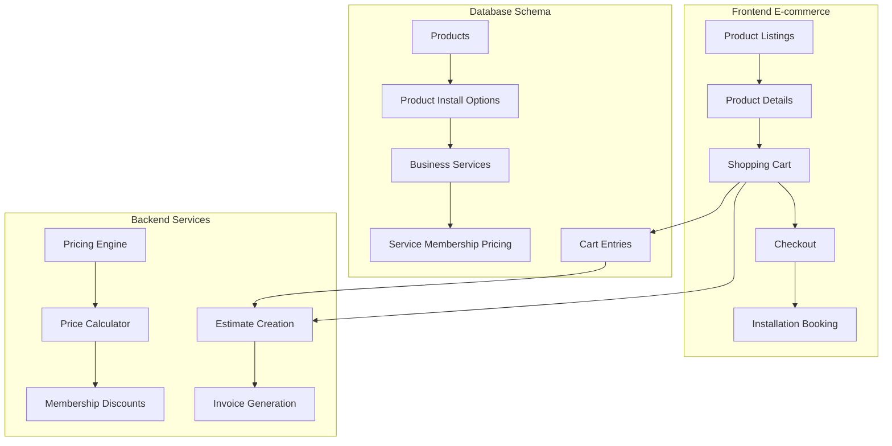

# 🛒 **E-COMMERCE + INSTALLATION SYSTEM**
## **Product Sales + Professional Installation Integration**

---

## 🎯 **VISION**
Transform the website into a professional e-commerce platform where customers can:
- **Browse products** (HVAC units, water heaters, electrical panels, etc.)
- **View installation pricing** for each product with membership discounts
- **Add to cart** with combined product + installation pricing
- **Schedule installation** as part of checkout
- **Get professional estimates** and book services

---

## 🏗️ **ARCHITECTURE OVERVIEW**



---

## 📊 **DATABASE SCHEMA DESIGN**

### **1. Product-Installation Linking**
```sql
-- Link products to their available installation services
CREATE TABLE product_installation_options (
    id UUID PRIMARY KEY,
    business_id UUID REFERENCES businesses(id),
    product_id UUID REFERENCES products(id),
    service_id UUID REFERENCES business_services(id),
    
    -- Installation-specific pricing
    base_install_price DECIMAL(10,2),
    complexity_multiplier DECIMAL(3,2) DEFAULT 1.0, -- For difficult installs
    
    -- Membership pricing overrides
    residential_install_price DECIMAL(10,2),
    commercial_install_price DECIMAL(10,2),
    premium_install_price DECIMAL(10,2),
    
    -- Requirements and compatibility
    requirements JSONB, -- Installation requirements
    compatibility_notes TEXT,
    estimated_duration_hours DECIMAL(4,2),
    
    is_active BOOLEAN DEFAULT TRUE,
    sort_order INTEGER DEFAULT 0
);
```

### **2. E-commerce Cart System**
```sql
-- Shopping cart for product + installation combinations
CREATE TABLE shopping_carts (
    id UUID PRIMARY KEY,
    session_id VARCHAR(255), -- For anonymous users
    customer_email VARCHAR(255),
    business_id UUID REFERENCES businesses(id),
    
    expires_at TIMESTAMPTZ,
    created_at TIMESTAMPTZ DEFAULT NOW()
);

CREATE TABLE cart_items (
    id UUID PRIMARY KEY,
    cart_id UUID REFERENCES shopping_carts(id),
    product_id UUID REFERENCES products(id),
    installation_option_id UUID REFERENCES product_installation_options(id),
    
    -- Quantities and pricing
    quantity INTEGER DEFAULT 1,
    unit_price DECIMAL(10,2), -- Product price
    install_price DECIMAL(10,2), -- Installation price
    total_price DECIMAL(10,2), -- Combined price
    
    -- Membership calculations
    membership_type VARCHAR(20), -- residential, commercial, premium
    membership_discount DECIMAL(10,2) DEFAULT 0,
    final_price DECIMAL(10,2),
    
    -- Installation preferences
    installation_required BOOLEAN DEFAULT TRUE,
    preferred_install_date DATE,
    special_instructions TEXT,
    
    created_at TIMESTAMPTZ DEFAULT NOW()
);
```

### **3. Enhanced Product Schema**
```sql
-- Extend existing products table for e-commerce
ALTER TABLE products ADD COLUMN IF NOT EXISTS
    -- E-commerce fields
    show_on_website BOOLEAN DEFAULT FALSE,
    requires_professional_install BOOLEAN DEFAULT FALSE,
    install_complexity VARCHAR(20) DEFAULT 'standard', -- standard, complex, expert
    
    -- SEO and marketing
    meta_title VARCHAR(255),
    meta_description TEXT,
    slug VARCHAR(255),
    
    -- Product variations (size, color, model)
    has_variations BOOLEAN DEFAULT FALSE,
    variation_options JSONB,
    
    -- Shipping and logistics
    shipping_weight DECIMAL(10,3),
    shipping_dimensions JSONB,
    requires_freight BOOLEAN DEFAULT FALSE,
    
    -- Installation details
    installation_time_estimate VARCHAR(50),
    warranty_years INTEGER DEFAULT 1,
    energy_efficiency_rating VARCHAR(10);

-- Add indexes
CREATE INDEX idx_products_website ON products(business_id, show_on_website) WHERE show_on_website = TRUE;
CREATE INDEX idx_products_slug ON products(business_id, slug);
```

---

## 💰 **PRICING ENGINE ARCHITECTURE**

### **Smart Pricing Calculator**
```typescript
interface PricingCalculation {
  productPrice: number;
  installPrice: number;
  subtotal: number;
  membershipDiscount: number;
  tax: number;
  total: number;
  savings: number;
  membershipType?: 'residential' | 'commercial' | 'premium';
}

class ProductInstallPricingEngine {
  calculateCombinedPricing(
    product: Product,
    installOption: ProductInstallationOption,
    membershipType?: MembershipType,
    quantity: number = 1
  ): PricingCalculation
}
```

### **Pricing Rules**
1. **Base Price** = Product Unit Price × Quantity
2. **Installation Price** = Base Install Price × Complexity Multiplier
3. **Membership Discount** = Apply to both product and installation
4. **Volume Discounts** = For multiple units
5. **Bundle Savings** = When buying product + installation together

---

## 🔌 **API ENDPOINTS DESIGN**

### **Product Catalog APIs**
```
GET /api/v1/public/products/{business_id}
  - Product listing with categories, filters, search
  - Include installation options and member pricing

GET /api/v1/public/products/{business_id}/{product_id}
  - Product details with installation options
  - Pricing calculator for different membership tiers

GET /api/v1/public/products/{business_id}/{product_id}/install-options
  - Available installation services for product
  - Pricing, requirements, scheduling info
```

### **Shopping Cart APIs**
```
POST /api/v1/public/cart
  - Create anonymous shopping cart

POST /api/v1/public/cart/{cart_id}/items
  - Add product + installation to cart
  - Calculate pricing with membership discounts

PUT /api/v1/public/cart/{cart_id}/items/{item_id}
  - Update quantities, installation preferences

GET /api/v1/public/cart/{cart_id}/pricing
  - Get detailed pricing breakdown
  - Tax calculations, shipping costs
```

### **Checkout & Integration APIs**
```
POST /api/v1/public/cart/{cart_id}/checkout
  - Convert cart to estimate/invoice
  - Integrate with existing booking system
  - Schedule installation appointments
```

---

## 🎨 **FRONTEND COMPONENTS DESIGN**

### **Product Catalog Pages**
```
pages/
├── products/
│   ├── index.tsx              # Product listing page
│   ├── [category]/
│   │   └── index.tsx          # Category page
│   └── [slug]/
│       └── index.tsx          # Product detail page
└── cart/
    ├── index.tsx              # Shopping cart
    └── checkout.tsx           # Checkout flow
```

### **Key React Components**
```typescript
// Product catalog components
<ProductGrid products={products} />
<ProductCard product={product} />
<ProductDetailPage product={product} />
<InstallationOptions options={installOptions} />
<PricingCalculator product={product} />

// Shopping cart components  
<ShoppingCart items={cartItems} />
<CartItem item={item} />
<PricingBreakdown pricing={pricing} />
<CheckoutForm cart={cart} />

// Integration components
<InstallationScheduler />
<MembershipPricingDisplay />
<ProductInstallBundle />
```

### **E-commerce UI Features**
- **Product image galleries** with zoom
- **Specification tables** with installation requirements
- **Live pricing calculator** with membership tiers
- **Installation scheduling** calendar integration
- **Cart persistence** across sessions
- **Progressive checkout** with address, scheduling, payment

---

## 🔗 **INTEGRATION POINTS**

### **1. Existing Systems Integration**
- **Estimates System**: Cart checkout creates estimate
- **Booking System**: Installation scheduling integration
- **Membership System**: Automatic discount application
- **Invoice System**: Convert estimates to invoices

### **2. Data Flow**
```
Product Selection → Add Installation → Calculate Pricing → Add to Cart 
     ↓
Shopping Cart → Membership Discounts → Checkout → Create Estimate
     ↓
Schedule Installation → Generate Invoice → Booking Confirmation
```

---

## 🚀 **IMPLEMENTATION PHASES**

### **Phase 1: Database Foundation** ⏱️ 2 days
- [ ] Create product-installation schema
- [ ] Add e-commerce fields to products
- [ ] Create cart and checkout tables
- [ ] Seed sample data

### **Phase 2: Pricing Engine** ⏱️ 3 days
- [ ] Build pricing calculation engine
- [ ] Implement membership discount logic
- [ ] Create pricing API endpoints
- [ ] Unit tests for pricing scenarios

### **Phase 3: Backend APIs** ⏱️ 3 days
- [ ] Product catalog endpoints
- [ ] Shopping cart CRUD operations
- [ ] Checkout and estimate creation
- [ ] Integration with booking system

### **Phase 4: Frontend E-commerce** ⏱️ 4 days
- [ ] Product listing and search
- [ ] Product detail pages
- [ ] Shopping cart implementation
- [ ] Checkout flow with scheduling

### **Phase 5: Integration & Testing** ⏱️ 2 days
- [ ] End-to-end integration testing
- [ ] Performance optimization
- [ ] Mobile responsive design
- [ ] Documentation and API specs

---

## 📈 **SUCCESS METRICS**

### **Technical KPIs**
- **Page Load Speed**: < 2s for product pages
- **API Response Time**: < 500ms for pricing calculations
- **Cart Conversion**: Track cart abandonment rates
- **Mobile Experience**: 100% responsive design

### **Business KPIs**
- **Average Order Value**: Track product + installation bundles
- **Membership Conversions**: Track membership signups from pricing
- **Installation Bookings**: Track scheduling conversion rates
- **Customer Satisfaction**: Integration with existing service quality

---

## 🔧 **TECHNICAL CONSIDERATIONS**

### **Performance Optimization**
- **Database Indexing**: Optimize product queries
- **Caching Strategy**: Product catalog and pricing cache
- **Image Optimization**: WebP images with CDN
- **API Rate Limiting**: Prevent abuse of pricing calculations

### **Security & Privacy**
- **Cart Session Management**: Secure session handling
- **PII Protection**: Secure customer data in carts
- **Price Validation**: Server-side pricing verification
- **SQL Injection Prevention**: Parameterized queries

### **Scalability Design**
- **Microservices Ready**: Pricing engine as separate service
- **Database Partitioning**: By business_id for multi-tenant
- **CDN Integration**: Static assets and product images
- **Horizontal Scaling**: Stateless cart operations

---

## 📋 **NEXT STEPS**

1. **Review & Approve Architecture** ✅
2. **Start Phase 1**: Database schema creation
3. **Set up development environment** for e-commerce
4. **Create project timeline** with milestones
5. **Begin implementation** with TDD approach

This e-commerce system will transform the website into a professional sales platform that seamlessly integrates product sales with installation services, providing customers with transparent pricing and streamlined purchasing experience.
