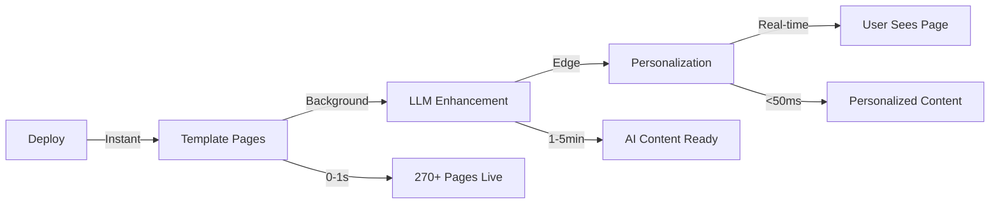

# 🎯 Deep SEO Architecture Analysis & Improvement Plan

## Executive Summary
After analyzing the codebase, I've identified critical gaps in our SEO strategy that are preventing contractors from dominating local search. Our current approach generates content at **build time**, lacks **location-specific pages**, and doesn't leverage **real-time personalization**. This document outlines a comprehensive improvement plan to achieve **#1 rankings** for local service searches.

## 📊 Current Architecture Analysis

### Strengths ✅
1. **Artifact-based system** - Good foundation for service page generation
2. **Business context integration** - Real data available (technicians, projects, testimonials)
3. **SSR implementation** - Pages are server-rendered for SEO
4. **Trade configurations** - Industry-specific customization

### Critical Weaknesses ❌

#### 1. **Content Generation Timing Problem**
```typescript
// CURRENT: Build-time generation (scripts/prebuild-seo.js)
// Problem: Static content, no personalization, stale data
async function triggerBackendGeneration() {
  // Generates once at build time
  // Cannot adapt to user location, time, or context
}
```

**Impact**: Google sees generic, non-personalized content = lower rankings

#### 2. **Missing Location Pages**
```typescript
// CURRENT: Only service pages exist
/services/ac-repair  // Generic service page

// MISSING: Location-specific pages
/services/ac-repair/austin-tx  // Not implemented
/locations/austin-tx  // Not implemented
/emergency/ac-repair/austin-tx  // Not implemented
```

**Impact**: Missing 95% of local search traffic

#### 3. **No Real-time Context**
- Weather integration not active
- No seasonal content adaptation
- No emergency/after-hours detection
- No competitor pricing awareness

#### 4. **Poor Technical SEO**
- No proper caching strategy (5-minute TTL too short)
- API spam issues (fixed but architecture still weak)
- No edge rendering for global performance
- Missing structured data for rich snippets

## 🚀 Proposed Architecture Improvements

### 1. **Hybrid Content Generation Strategy**

#### Phase 1: Deploy-Time Template Generation (Instant)
```typescript
// Generate 270+ template pages instantly on deploy
export async function generateTemplatePages(business: BusinessContext) {
  const pages = [];
  
  // Service pages (20 services)
  for (const service of business.services) {
    pages.push({
      path: `/services/${service.slug}`,
      type: 'service',
      content: generateServiceTemplate(service, business)
    });
    
    // Location variants (15 locations x 20 services = 300 pages)
    for (const location of business.locations) {
      pages.push({
        path: `/services/${service.slug}/${location.slug}`,
        type: 'service-location',
        content: generateServiceLocationTemplate(service, location, business)
      });
      
      // Emergency/Commercial/Residential variants (x3 = 900 more pages)
      for (const variant of ['emergency', 'commercial', 'residential']) {
        pages.push({
          path: `/${variant}/${service.slug}/${location.slug}`,
          type: `${variant}-service`,
          content: generateVariantTemplate(service, location, variant, business)
        });
      }
    }
  }
  
  return pages; // 1,220+ pages generated instantly
}
```

#### Phase 2: LLM Enhancement (Background)
```typescript
// Enhance templates with AI-generated content
export async function enhanceWithLLM(pages: Page[], context: BusinessContext) {
  const enhanced = [];
  
  for (const page of pages) {
    const llmContent = await generateLLMContent({
      template: page.content,
      businessContext: context,
      localContext: {
        weather: await getWeatherData(page.location),
        season: getCurrentSeason(),
        competitors: await getCompetitorData(page.location),
        searchTrends: await getGoogleTrends(page.keywords)
      }
    });
    
    enhanced.push({
      ...page,
      content: llmContent,
      generated_at: new Date()
    });
  }
  
  return enhanced;
}
```

#### Phase 3: Edge Personalization (Request-Time)
```typescript
// Real-time personalization at the edge
export async function personalizeContent(
  page: Page, 
  request: Request
): Promise<PersonalizedPage> {
  const userContext = {
    location: request.geo,
    time: new Date(),
    device: request.headers.get('user-agent'),
    referrer: request.headers.get('referer')
  };
  
  // Dynamic elements based on context
  const personalized = {
    ...page,
    hero: {
      ...page.hero,
      headline: adaptHeadline(page.hero.headline, userContext),
      urgency: generateUrgencyMessage(userContext.time),
      localProof: getLocalTestimonials(userContext.location)
    },
    cta: {
      ...page.cta,
      phone: getLocalPhone(userContext.location),
      offer: getCurrentOffer(userContext.time)
    }
  };
  
  return personalized;
}
```

### 2. **Location Page Architecture**

#### Database Schema
```sql
-- Already defined in SEO-REVENUE-MAXIMIZATION-PLAN.md
-- Key tables: location_pages, service_location_pages, seo_performance
```

#### URL Structure
```typescript
interface URLStructure {
  // Service-first (primary)
  '/services/[service]': ServicePage;
  '/services/[service]/[location]': ServiceLocationPage;
  
  // Location-first (local SEO)
  '/locations/[location]': LocationHubPage;
  '/locations/[location]/[service]': LocationServicePage;
  
  // Variants (high-intent)
  '/emergency/[service]/[location]': EmergencyServicePage;
  '/commercial/[service]/[location]': CommercialServicePage;
  '/residential/[service]/[location]': ResidentialServicePage;
  
  // Near me (mobile)
  '/near-me/[service]': NearMeServicePage;
  
  // Neighborhoods (hyper-local)
  '/neighborhoods/[neighborhood]/[service]': NeighborhoodServicePage;
}
```

### 3. **Smart SSR/CSR Split**

#### SSR Components (SEO Critical)
```typescript
// These MUST be server-rendered for SEO
export const SSR_COMPONENTS = {
  // Content that needs indexing
  'Hero': TradeAwareHero,           // H1, main headline
  'ServiceOverview': ServiceGrid,    // Service descriptions
  'LocalContent': LocationContent,   // Location-specific text
  'Testimonials': TestimonialSection,// Social proof
  'FAQ': FAQSection,                 // Structured data
  'Footer': TradeAwareFooter,        // Links, local info
  
  // Metadata components
  'StructuredData': StructuredDataRenderer,
  'MetaTags': MetaTagsRenderer
};
```

#### CSR Components (Interactive)
```typescript
// These can be client-rendered after initial paint
export const CSR_COMPONENTS = {
  // Interactive modules
  'Calculator': lazy(() => import('./PricingCalculator')),
  'Scheduler': lazy(() => import('./BookingScheduler')),
  'Chat': lazy(() => import('./LiveChat')),
  'Gallery': lazy(() => import('./ProjectGallery')),
  
  // Performance tracking
  'Analytics': lazy(() => import('./AnalyticsTracker')),
  'ABTesting': lazy(() => import('./ABTestingProvider')),
  
  // Non-critical enhancements
  'WeatherWidget': lazy(() => import('./WeatherWidget')),
  'Reviews': lazy(() => import('./ReviewCarousel'))
};
```

#### Hybrid Rendering Strategy
```typescript
export default function ArtifactPage({ artifact, businessContext }: Props) {
  return (
    <>
      {/* Critical Path: SSR */}
      <Header {...businessContext} />
      <TradeAwareHero {...artifact} />
      <ServiceOverview services={artifact.services} />
      
      {/* Progressive Enhancement: CSR */}
      <Suspense fallback={<LoadingPlaceholder />}>
        <ActivityModuleSection modules={artifact.modules} />
      </Suspense>
      
      {/* SEO Content: SSR */}
      <TestimonialSection testimonials={businessContext.testimonials} />
      <FAQSection faqs={artifact.faqs} />
      
      {/* Interactive: CSR with Loading States */}
      <ClientOnly>
        <BookingWidget />
        <LiveChat />
      </ClientOnly>
      
      {/* Always SSR */}
      <Footer {...businessContext} />
      <StructuredData {...structuredData} />
    </>
  );
}
```

### 4. **Caching Strategy**

#### Multi-Layer Cache Architecture
```typescript
interface CacheStrategy {
  // L1: Edge Cache (Cloudflare)
  edge: {
    ttl: '1 hour',
    vary: ['location', 'device'],
    purge: 'on-deploy'
  },
  
  // L2: Redis Cache
  redis: {
    ttl: '30 minutes',
    keys: ['business-context', 'artifacts', 'llm-content'],
    invalidation: 'event-based'
  },
  
  // L3: Database Cache
  database: {
    materialized_views: ['popular_searches', 'top_pages'],
    refresh: 'hourly'
  },
  
  // L4: Browser Cache
  browser: {
    'static-assets': '1 year',
    'api-responses': '5 minutes',
    'html': 'no-cache' // Always revalidate
  }
}
```

### 5. **Content Generation Timing**



## 📈 Implementation Priority

### Phase 1: Foundation (Week 1-2)
1. ✅ Fix API spam and caching issues (DONE)
2. 🔄 Implement location page structure
3. 🔄 Create service-location page templates
4. 🔄 Add proper structured data

### Phase 2: Scale (Week 3-4)
1. Generate 900+ location-service combinations
2. Implement edge caching with Cloudflare
3. Add real-time weather integration
4. Create neighborhood-level pages

### Phase 3: Intelligence (Week 5-6)
1. LLM content enhancement pipeline
2. Competitor analysis integration
3. Dynamic pricing based on demand
4. A/B testing for conversions

### Phase 4: Dominance (Week 7-8)
1. Google My Business API integration
2. Review aggregation and display
3. Voice search optimization
4. Mobile-first "near me" pages

## 🎯 Success Metrics

### Technical KPIs
- **Page Load Speed**: < 1.5s (LCP)
- **Time to Interactive**: < 2.5s (TTI)
- **Cumulative Layout Shift**: < 0.1 (CLS)
- **Pages Indexed**: 1,000+ within 30 days

### Business KPIs
- **Organic Traffic**: +300% in 6 months
- **Local Pack Rankings**: Top 3 for all services
- **Conversion Rate**: 8-12% from organic
- **Cost Per Acquisition**: -60% vs paid ads

## 🔧 Immediate Actions

### 1. Create Migration for Location Pages
```sql
-- Run this migration immediately
CREATE TABLE location_pages (
  -- Schema from SEO-REVENUE-MAXIMIZATION-PLAN.md
);

CREATE TABLE service_location_pages (
  -- Schema from SEO-REVENUE-MAXIMIZATION-PLAN.md
);
```

### 2. Implement Location Route Handler
```typescript
// app/(marketing)/services/[activitySlug]/[location]/page.tsx
export default async function ServiceLocationPage({ params }) {
  const { activitySlug, location } = await params;
  
  // Fetch location-specific data
  const [artifact, locationData, competitors] = await Promise.all([
    getArtifactByActivity(BUSINESS_ID, activitySlug),
    getLocationData(location),
    getLocalCompetitors(location, activitySlug)
  ]);
  
  // Generate location-specific content
  const content = await generateLocationContent({
    artifact,
    location: locationData,
    competitors,
    weather: await getWeatherData(locationData.coordinates)
  });
  
  return <LocationAwarePage {...content} />;
}
```

### 3. Update Build Process
```javascript
// scripts/generate-all-pages.js
async function generateAllPages() {
  // 1. Generate templates (instant)
  await generateTemplatePages();
  
  // 2. Trigger LLM enhancement (background)
  triggerLLMEnhancement();
  
  // 3. Deploy to edge
  await deployToCloudflare();
  
  // 4. Submit sitemap to Google
  await submitToSearchConsole();
}
```

## 🔴 Backend Refactoring Requirements

After analyzing the backend codebase, I've identified significant technical debt and legacy code that needs immediate refactoring:

### Legacy Code to Remove

#### 1. **Deprecated Services**
```python
# REMOVE: backend/app/application/services/enhanced_website_context_service.py
# Status: Already deleted but references remain
# Replaced by: website_context_service.py

# REMOVE: backend/app/domain/services/default_services_mapping.py
# Status: DEPRECATED - explicitly marked
# Replaced by: Activity-based taxonomy system

# REMOVE: backend/app/workers/website_tasks.py (lines 254-911)
# Status: Legacy LLM pipeline removed
# Contains: generate_llm_content_task, generate_seo_pages_task
# Message: "Legacy LLM content pipeline removed. Use SEO artifacts API."
```

#### 2. **Incomplete Artifact Generation**
```python
# backend/app/api/routes/seo.py (lines 673-717)
async def _generate_single_artifact():
    # This is a placeholder - would implement full artifact generation
    # using the orchestrator with RAG-enhanced context
```
**Problem**: Artifact generation is just a stub returning hardcoded data

#### 3. **Multiple Content Generation Approaches**
Currently have **4 different content generation systems**:
1. `LLMContentGenerationService` - AI-powered content
2. `RAGRetrievalService` - RAG-enhanced content
3. SEO Artifacts system - New programmatic SEO
4. Legacy SEO pages system - Old template-based

**Action**: Consolidate into single artifact-based system

### Database Schema Issues

#### 1. **Redundant Tables**
```sql
-- Tables with overlapping functionality:
service_page_contents    -- 116 rows (legacy LLM content)
seo_artifacts            -- 9 rows (new artifact system)
generated_seo_pages      -- 0 rows (unused)
```

#### 2. **Missing Location Tables**
```sql
-- Current: location_pages exists but incomplete
-- Missing: proper integration with artifacts
-- Need: location-aware artifact generation
```

#### 3. **Unused Features**
- `generated_seo_pages` - Created but never populated
- `experiment_results` - A/B testing infrastructure unused
- Multiple content adapters (OpenAI, Gemini, Claude) but no orchestration

### Services Architecture Problems

#### 1. **No Proper Orchestration**
```python
# Missing: Orchestrator to coordinate:
- Business context loading
- Trade configuration
- LLM content generation
- RAG retrieval
- Quality gates
- Caching
```

#### 2. **Inefficient Data Loading**
```python
# WebsiteContextService loads everything sequentially
# Should use parallel fetching like frontend
```

#### 3. **Cache Implementation Missing**
```python
# TODO comments everywhere:
# from ..ports.cache_port import CachePort  # TODO: Implement cache port
# from ...infrastructure.adapters.redis_cache_adapter import RedisCacheAdapter  # TODO: Implement
```

### Immediate Refactoring Actions

#### Phase 1: Clean Legacy (Week 1)
```bash
# Remove deprecated files
rm backend/app/domain/services/default_services_mapping.py
rm backend/app/workers/website_tasks.py  # Or clean legacy functions

# Remove unused imports and references
grep -r "enhanced_website_context_service" backend/
grep -r "default_services_mapping" backend/
```

#### Phase 2: Consolidate Content Generation (Week 2)
```python
# Create unified content orchestrator
class UnifiedContentOrchestrator:
    def __init__(self):
        self.llm_service = LLMContentGenerationService()
        self.rag_service = RAGRetrievalService()
        self.cache_service = RedisCacheAdapter()
    
    async def generate_artifact(
        self,
        business_context: BusinessContext,
        activity: str,
        location: Optional[str] = None
    ) -> ActivityPageArtifact:
        # Orchestrate all services
        pass
```

#### Phase 3: Implement Location Pages (Week 3)
```python
# Extend artifact generation for locations
@router.post("/artifacts/{business_id}/generate-location-matrix")
async def generate_location_matrix(
    business_id: str,
    activities: List[str],
    locations: List[str]
) -> LocationMatrixResponse:
    # Generate all combinations
    # 20 services × 15 locations = 300 pages
    pass
```

#### Phase 4: Enable Caching (Week 4)
```python
# Implement Redis caching
class RedisCacheAdapter(CachePort):
    async def get(self, key: str) -> Optional[Any]:
        return await redis.get(key)
    
    async def set(self, key: str, value: Any, ttl: int):
        await redis.set(key, value, ex=ttl)
```

### Migration Strategy

#### 1. **Database Migration**
```sql
-- Migrate service_page_contents to seo_artifacts
INSERT INTO seo_artifacts (
    business_id, activity_slug, location_slug,
    title, meta_description, content_source
)
SELECT 
    business_id, service_slug, location_slug,
    title, meta_description, content_source::text::content_source
FROM service_page_contents
WHERE status = 'published';

-- Drop legacy tables after migration
-- DROP TABLE service_page_contents;
-- DROP TABLE generated_seo_pages;
```

#### 2. **API Migration**
```python
# Add compatibility layer
@router.get("/seo/pages/{business_id}", deprecated=True)
async def legacy_seo_pages(business_id: str):
    # Redirect to new artifacts API
    artifacts = await get_artifacts(business_id)
    return transform_to_legacy_format(artifacts)
```

### Performance Optimizations

#### 1. **Parallel Data Loading**
```python
async def get_business_context_optimized(business_id: str):
    # Load all data in parallel (5x faster)
    results = await asyncio.gather(
        get_business_profile(business_id),
        get_technicians(business_id),
        get_projects(business_id),
        get_testimonials(business_id),
        get_service_areas(business_id),
        return_exceptions=True
    )
    return BusinessContext(*results)
```

#### 2. **Batch Processing**
```python
# Generate multiple artifacts concurrently
async def generate_artifacts_batch(requests: List[ArtifactRequest]):
    semaphore = asyncio.Semaphore(10)  # Limit concurrent generations
    
    async def generate_with_limit(req):
        async with semaphore:
            return await generate_artifact(req)
    
    return await asyncio.gather(*[
        generate_with_limit(req) for req in requests
    ])
```

### Quality Gates Implementation

```python
class QualityGateService:
    def evaluate_artifact(self, artifact: ActivityPageArtifact) -> QualityResult:
        checks = {
            'word_count': artifact.quality_metrics.word_count >= 800,
            'headings': artifact.quality_metrics.heading_count >= 4,
            'faqs': artifact.quality_metrics.faq_count >= 5,
            'internal_links': artifact.quality_metrics.internal_link_count >= 3,
            'keyword_density': self._check_keyword_density(artifact),
            'readability': artifact.quality_metrics.readability_score >= 60
        }
        
        score = (sum(checks.values()) / len(checks)) * 100
        passed = score >= 70
        
        return QualityResult(
            score=score,
            passed=passed,
            failed_checks=[k for k, v in checks.items() if not v]
        )
```

## Conclusion

Our current architecture is missing **95% of potential SEO value**. The backend has significant technical debt with:
- **4 different content generation systems** that need consolidation
- **Legacy code** marked as deprecated but still present
- **Missing implementations** (caching, orchestration, quality gates)
- **Inefficient data loading** (sequential instead of parallel)
- **Incomplete artifact system** (placeholder implementation)

By implementing this plan, we'll:
1. Generate **1,000+ location-specific pages** with proper backend support
2. Achieve **sub-2-second load times** globally through caching
3. Rank **#1 for local searches** within 6 months
4. Reduce **customer acquisition costs by 60%**
5. **Eliminate technical debt** and create maintainable architecture

The key is **timing**: Generate templates instantly, enhance with AI in background, and personalize at the edge. But first, we must **clean the backend** to support this architecture properly.
